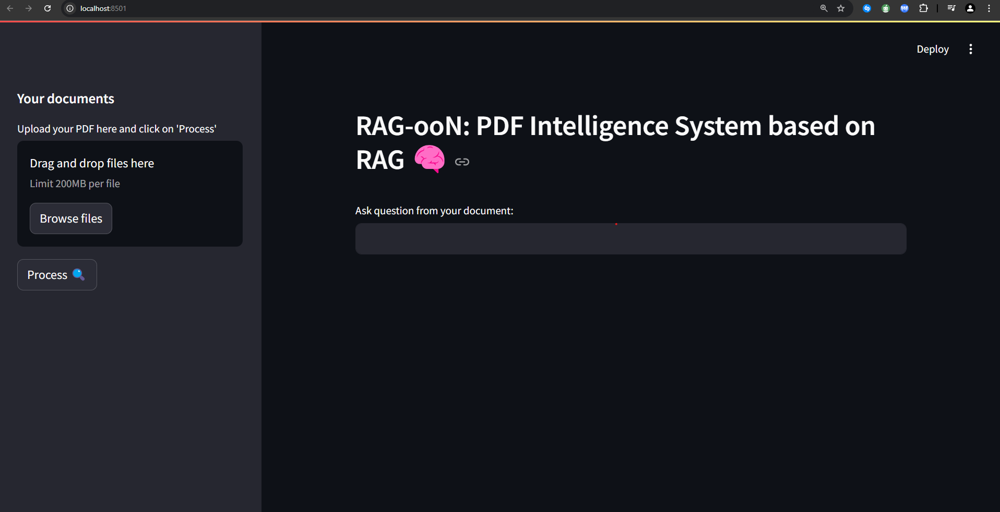

# RAG-ooN


# RAG (Retrieval-Augmented Generation) System

This project implements a Retrieval-Augmented Generation (RAG) system based on a custom made Vectorstore & Conversation chain . The system retrieves relevant inforamtion from a set of PDFs and generates answers to queries using a pre-trained language model (GPT-2 or GPT-Neo).
This system was built using Stramlit wich is an open-source Python framework for data scientists and AI/ML engineers to deliver interactive data apps.



Remark : In this project I tried to re-build the langchaing's "conversation chain" strcuture from scratch. This has to take in to consideration the context window to ipdate the lenght of the "cash" of the model.

These are some usefull material/links that I used to build this project :

[Lance Martin's amazing course about RAG](https://www.youtube.com/watch?v=sVcwVQRHIc8) and the [GitHub](https://github.com/langchain-ai/rag-from-scratch?tab=readme-ov-file) Where you can find the Notebooks with the source code.


## Features

- **PDF Text Extraction**: Extracts text from PDF files using `PyPDF2`.
- **Embedding Generation**: Encodes extracted texts into embeddings using a pre-trained language model .
- **Document Retrieval**: Uses SentenceTransformer to create embeddings with document-level metadata and retreive relevant chunks using cosine similarity.
- **Answer Generation**: Uses any LLM of your choice (depending on your computational resources) to generate an answer based on the retrieved chunks/documents.

## Requirements

- Docker (with GPU support if you want to use a GPU)
- NVIDIA Container Toolkit (for GPU support)
- Python dependencies (listed in `requirements.txt`)

## Docker Setup

This project comes with a pre-configured `Dockerfile` and `requirements.txt` for building and running the RAG system in a Docker container.

### Step 1: Build the Docker Image

Clone the repository and navigate to the project directory.

```bash
git clone https://github.com/yourusername/rag-system.git
cd rag-system
```

Build the Docker image using the provided `Dockerfile`:

```bash
docker build -t ragoon .
```

### Step 2: Run the Docker Container

To run the container, you have two options depending on whether you have a GPU or not.

#### For machines with GPU support:

Use the `--gpus all` flag to ensure the container has access to the GPU.

```bash
docker run -it --rm --gpus all -p 8501:8501 -v $PWD:/app ragoon_cuda /bin/bash
```

- `-v $(pwd):/app`: Mounts the current directory to `/app` inside the container so any code changes are reflected immediately.
- `-p 8501:8501`: Exposes port 8501 for Streamlit (if you're using it).

### Step 3: Running the System

Once the Docker container is running, You can launch you application by using the following command: 
```bash
streamlit run app.py
```

With this your RAG system will is ready. You can access the app at `http://localhost:8501`.

### Step 4: Example Usage

1. **Modify the PDFs**: Place your PDF files in the `data/` directory.
2. **Run the Script**: You can modify the script and run your custom queries, or use the Streamlit interface (if integrated).

### Step 5: Monitor Logs

The container will output logs for the script execution, including logs from the `loguru` logger. You can monitor the logs in real-time by using:

```bash
docker logs -f <container_id>
```

This allows you to track the progress of document extraction, embedding generation, and answer generation.

## Python Dependencies

The following dependencies are required for the project. You can install them using the provided `requirements.txt` file.

To install/upgarde the dependencies manually:

```bash
pip install -r requirements.txt
```

## License

This project is licensed under the MIT License - see the [LICENSE](LICENSE) file for details.

## Troubleshooting

- **CUDA Not Available**: If you're getting an error about CUDA not being available, make sure you have the necessary NVIDIA drivers installed on your machine. Also, verify that the `nvidia-docker` package is installed and working.
- **Memory Issues**: If you're running into memory issues, try reducing the model size or splitting your PDFs into smaller parts for processing.
