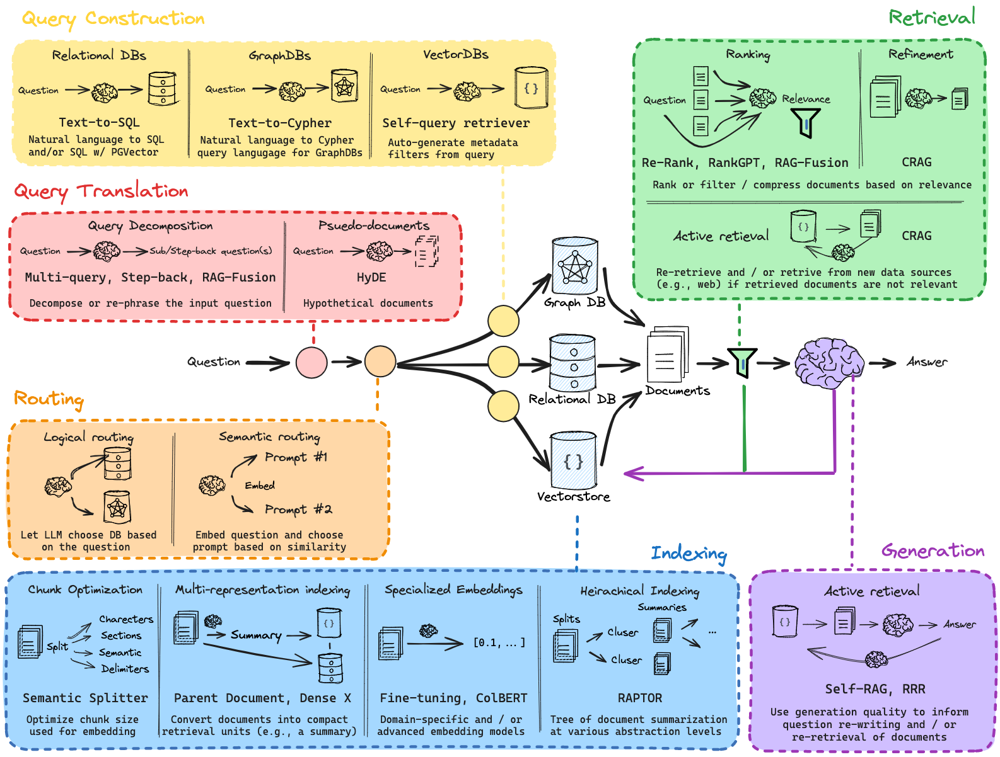

# RAG-ooN


https://github.com/langchain-ai/rag-from-scratch?tab=readme-ov-file


https://www.youtube.com/watch?v=sVcwVQRHIc8



# RAG (Retrieval-Augmented Generation) System

This project implements a Retrieval-Augmented Generation (RAG) system using the PyTorch, FAISS, and Transformers libraries. The system retrieves relevant documents from a set of PDFs and generates answers to queries using a pre-trained language model (GPT-2 or GPT-Neo).

## Features

- **PDF Text Extraction**: Extracts text from PDF files using `pdfplumber`.
- **Embedding Generation**: Encodes extracted texts into embeddings using a pre-trained language model (GPT-2 or GPT-Neo).
- **Document Retrieval**: Uses FAISS for fast retrieval of the most relevant document based on a query.
- **Answer Generation**: Uses GPT-2/GPT-Neo to generate an answer based on the retrieved document.

## Requirements

- Docker (with GPU support if you want to use a GPU)
- NVIDIA Container Toolkit (for GPU support)
- Python dependencies (listed in `requirements.txt`)

## Docker Setup

This project comes with a pre-configured `Dockerfile` and `requirements.txt` for building and running the RAG system in a Docker container.

### Step 1: Build the Docker Image

Clone the repository and navigate to the project directory.

```bash
git clone https://github.com/yourusername/rag-system.git
cd rag-system
```

Build the Docker image using the provided `Dockerfile`:

```bash
docker build -t ragoon .
```

### Step 2: Run the Docker Container

To run the container, you have two options depending on whether you have a GPU or not.

#### For machines with GPU support:

Use the `--gpus all` flag to ensure the container has access to the GPU.

```bash
docker run -it --rm --gpus all -v $PWD:/app ragoon_cuda /bin/bash
```

#### For machines without GPU support:

If you don't have a GPU, just run the container without the GPU flag:

```bash
docker run -v $(pwd):/app -p 8501:8501 rag-system
```

- `-v $(pwd):/app`: Mounts the current directory to `/app` inside the container so any code changes are reflected immediately.
- `-p 8501:8501`: Exposes port 8501 for Streamlit (if you're using it).

### Step 3: Running the System

Once the Docker container is running, the RAG system will be ready. If you're using **Streamlit** for interaction, you can access the app at `http://localhost:8501`.

### Step 4: Example Usage

1. **Modify the PDFs**: Place your PDF files in the `data/` directory.
2. **Run the Script**: You can modify the script and run your custom queries, or use the Streamlit interface (if integrated).

### Step 5: Monitor Logs

The container will output logs for the script execution, including logs from the `loguru` logger. You can monitor the logs in real-time by using:

```bash
docker logs -f <container_id>
```

This allows you to track the progress of document extraction, embedding generation, and answer generation.

## Python Dependencies

The following dependencies are required for the project. You can install them using the provided `requirements.txt` file.

```txt
torch>=2.0.0
transformers>=4.30.0
loguru>=0.6.0
faiss-cpu>=1.7.2  # Use faiss-gpu for GPU support
sentence-transformers>=2.2.0
pdfplumber>=0.7.4
streamlit>=1.24.0
```

To install the dependencies manually:

```bash
pip install -r requirements.txt
```

## License

This project is licensed under the MIT License - see the [LICENSE](LICENSE) file for details.

## Troubleshooting

- **CUDA Not Available**: If you're getting an error about CUDA not being available, make sure you have the necessary NVIDIA drivers installed on your machine. Also, verify that the `nvidia-docker` package is installed and working.
- **Memory Issues**: If you're running into memory issues, try reducing the model size or splitting your PDFs into smaller parts for processing.

## Acknowledgments

- **PyTorch**: For the powerful machine learning framework.
- **Transformers**: For providing pre-trained language models like GPT-2 and GPT-Neo.
- **FAISS**: For efficient similarity search on embeddings.
- **Streamlit**: For the easy-to-use interface for building web applications.

---

This README should help you set up, build, and run the RAG system using Docker, as well as guide you through basic usage. If you encounter any issues, feel free to open an issue in the repository.
```

### Explanation of Sections:

1. **Features**: Summarizes the functionality of the RAG system.
2. **Requirements**: Lists the prerequisites, including Docker and Python libraries.
3. **Docker Setup**: Detailed instructions on how to build and run the Docker container, both for GPU and non-GPU machines.
4. **Usage**: Explains how to use the system, including how to add PDF files, run the system, and access logs.
5. **Python Dependencies**: Lists the required Python packages and provides the option to install them manually.
6. **License**: Placeholder for the project license (MIT).
7. **Troubleshooting**: Common issues and solutions.
